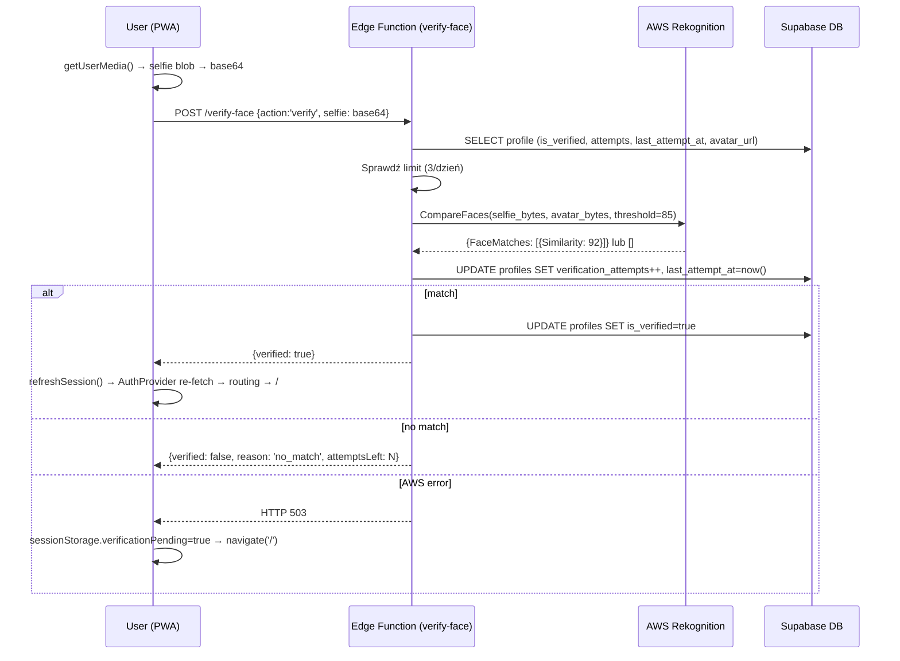

# feat: Weryfikacja profilu przez face comparison

## Przegląd

Dodanie weryfikacji tożsamości opartej na porównaniu selfie z avatarem profilowym przez AWS Rekognition CompareFaces. Niezweryfikowani użytkownicy nie mogą tworzyć ani dołączać do aktywności. Weryfikacja odbywa się automatycznie, bez udziału admina.

## Ujęcie problemu

Użytkownicy umawiają się na spotkania i potrzebują pewności, że osoba na spotkaniu jest tą z profilu. Brak weryfikacji umożliwia tworzenie fałszywych kont z cudzymi zdjęciami. (zob. źródło: docs/dev-brainstorms/2026-04-09-profile-verification-requirements.md)

## Śledzenie wymagań

- R1. Pole `is_verified` w tabeli `profiles`
- R2. Nowa trasa `/verify` w auth flow po `/setup`
- R3. Ekran `/verify` z kamerą selfie + porównanie z avatarem
- R4. Walidacja twarzy przy wgrywaniu avatara (odrzucenie jeśli brak twarzy)
- R5. AWS Rekognition przez Supabase Edge Function
- R6. Sukces → `is_verified = true`, redirect na mapę
- R7. Porażka → komunikat z pozostałymi próbami + sugestia zmiany avatara
- R8. Max 3 próby/dzień (reset o północy UTC)
- R9. API down → tymczasowy dostęp + banner na mapie
- R10. Tworzenie aktywności zablokowane dla niezweryfikowanych
- R11. Dołączanie do aktywności zablokowane dla niezweryfikowanych
- R12. Badge ✓ przy organizatorze (ActivitySheet) + na liście uczestników
- R13. Zmiana avatara cofa `is_verified = false` + ostrzeżenie + redirect na `/verify`
- R14. Selfie usuwane z Storage natychmiast po odpowiedzi z API
- R15. Migracja: istniejący użytkownicy dostają `is_verified = true`

## Granice scope'u

- Brak liveness detection (świadomie zaakceptowane)
- Brak moderacji ręcznej
- Brak weryfikacji dokumentu tożsamości
- Lista uczestników z badge tylko w istniejącym ekranie ustawień aktywności (nie nowy widok)
- Weryfikacja nie wygasa (chyba że zmiana avatara)

## Kontekst i research

### Relevantny kod i wzorce

- Routing: `src/App.tsx` linie 141–179 — pattern `if (!session) / if (!profile) / else` do replikacji dla `if (!profile.is_verified)`
- Avatar upload: `src/features/auth/ProfileSetupPage.tsx` linie 51–66 — upload do bucketu `avatars`, ścieżka `{userId}/avatar.{ext}`; to samo w `src/features/profile/ProfilePage.tsx` linie 59–78
- Access gate pattern: `src/features/activities/ActivitySheet.tsx` linie 114–143 — `isAtLimit` gate jako wzorzec dla `isVerified` gate
- Edge Function: `supabase/functions/activity-lifecycle/index.ts` — autoryzacja przez `SUPABASE_SERVICE_ROLE_KEY`, AWS SDK v3 przez `npm:` prefix jest wspierane w Deno

### Wiedza instytucjonalna

- Brak relevantnych wpisów w `docs/solutions/`

### Referencje zewnętrzne

- AWS Rekognition CompareFaces: threshold 85% (kompromis między strict 90% a default 80%); `QualityFilter: "HIGH"` eliminuje złe ujęcia
- AWS SDK v3 w Deno: `import { RekognitionClient, CompareFacesCommand } from "npm:@aws-sdk/client-rekognition"`
- Koszt: ~$1/1000 wywołań; free tier = 1000/miesiąc przez 12 miesięcy
- Camera PWA: `getUserMedia({ video: { facingMode: 'user' } })` + `canvas.toBlob()` + `playsInline` dla iOS
- `DetectFacesCommand` (ten sam klient) dla walidacji avatara

## Kluczowe decyzje techniczne

- **AWS Rekognition zamiast Azure Face API**: SDK v3 działa natywnie w Deno przez `npm:` prefix; Azure wymaga ręcznych REST call z SigV4
- **Threshold 85%**: między domyślnym 80% (za permisywny) a strict 90% (za dużo false negatives); powinien być konfiguowalny jako `FACE_SIMILARITY_THRESHOLD` env var
- **Selfie jako bajty w pamięci, nie w Storage**: selfie → base64 → Edge Function → AWS → wynik → update profile. Selfie nigdy nie trafia do Supabase Storage (R14)
- **Jeden Edge Function `verify-face` z `action` param**: obsługuje dwa tryby: `validate-avatar` (DetectFaces po uploadzie avatara) i `verify` (CompareFaces przy weryfikacji). Nie duplikujemy inicjalizacji klienta AWS.
- **Licznik prób w tabeli `profiles`**: dwa pola `verification_attempts int` + `last_attempt_at timestamptz`. Reset gdy `last_attempt_at::date != current_date`. Prosta kolumna zamiast osobnej tabeli.
- **API-down state przez sessionStorage**: gdy Edge Function zwraca 503, klient zapisuje `sessionStorage.verificationPending = 'true'`. AppRoutes czyta tę flagę: niezweryfikowany + pending → wpuszcza na mapę z banerem. Czyste, zero zmian w DB.
- **Walidacja twarzy avatara**: client uploaduje → wywołuje `verify-face?action=validate-avatar` → jeśli brak twarzy: usuwa plik i zwraca błąd do UI. Zamiast MediaPipe w bundlu, reuse istniejącego AWS klienta.
- **Bramy: tylko frontend (bez RLS)**: RLS dla `is_verified` dałby generyczne błędy API bez możliwości pokazania kontekstowego komunikatu. Frontend gate + Edge Function authorization jest wystarczające.

## Otwarte pytania

### Rozwiązane podczas planowania

- **Który AWS serwis**: Rekognition (nie Azure) — łatwiejsze w Deno
- **Gdzie selfie**: tylko w pamięci Edge Function, nie w Storage
- **Gdzie licznik prób**: kolumny w `profiles`, nie osobna tabela
- **Jak API-down state**: sessionStorage po stronie klienta
- **Walidacja avatara**: DetectFaces w tej samej Edge Function

### Odroczone do implementacji

- Dokładna ścieżka do ekranu listy uczestników w ustawieniach aktywności (trzeba zlokalizować plik)
- Wartość threshold — zacząć od 85%, dostroić po testach
- Format błędów i obsługa edge case gdy avatar jest w niskiej rozdzielczości

---

## Implementation Units

```
Zależności: 1 → 2 → 3 → 4 → 5 → 6 → 7
```

---

- [ ] **Unit 1: Migracja bazy danych**

**Cel:** Dodanie pól weryfikacji do `profiles` i grandfathering istniejących użytkowników.

**Wymagania:** R1, R15

**Zależności:** Brak

**Pliki:**
- Stwórz: `supabase/migrations/20260409_add_verification.sql`
- Modyfikuj: `src/lib/database.types.ts` — dodaj nowe pola do `profiles.Row` i `profiles.Update`

**Podejście:**
```sql
ALTER TABLE public.profiles
  ADD COLUMN is_verified boolean NOT NULL DEFAULT false,
  ADD COLUMN verification_attempts integer NOT NULL DEFAULT 0,
  ADD COLUMN last_attempt_at timestamptz;

-- Grandfathering: wszyscy istniejący użytkownicy = zweryfikowani
UPDATE public.profiles SET is_verified = true;
```
W `database.types.ts` dodać do `Row`: `is_verified: boolean`, `verification_attempts: number`, `last_attempt_at: string | null`.

**Scenariusze testowe:**
- Po migracji: wszyscy istniejący użytkownicy mają `is_verified = true`
- Nowy profil tworzony po migracji ma `is_verified = false`
- Kolumny `verification_attempts` i `last_attempt_at` istnieją i mają odpowiednie defaults

**Weryfikacja:**
- `SELECT COUNT(*) FROM profiles WHERE is_verified = false` → 0 (na istniejących danych)
- TypeScript compiles bez błędów po aktualizacji `database.types.ts`

---

- [ ] **Unit 2: Edge Function `verify-face`**

**Cel:** Serverless endpoint obsługujący walidację twarzy avatara i weryfikację selfie vs avatar.

**Wymagania:** R5, R6, R7, R8, R14

**Zależności:** Unit 1 (pola w profiles)

**Pliki:**
- Stwórz: `supabase/functions/verify-face/index.ts`

**Podejście:**

Funkcja przyjmuje JSON z `action: 'validate-avatar' | 'verify'`:

**`validate-avatar`**: Pobiera URL avatara z profilu użytkownika → wywołuje `DetectFacesCommand` → zwraca `{ faceDetected: boolean }`. Błąd jeśli brak twarzy.

**`verify`**: 
1. Weryfikuje JWT z Authorization headera (reuse wzorca z activity-lifecycle)
2. Pobiera profil usera — sprawdza `is_verified` (już zweryfikowany?), `verification_attempts` i `last_attempt_at` (limit dzienny)
3. Resetuje licznik jeśli `last_attempt_at::date != current_date`
4. Odbiera selfie jako base64 z body requestu
5. Pobiera URL avatara z profilu
6. Wywołuje `CompareFacesCommand` (threshold z `FACE_SIMILARITY_THRESHOLD` env var, default 85, `QualityFilter: "HIGH"`)
7. Inkrementuje `verification_attempts` i ustawia `last_attempt_at = now()`
8. Jeśli match: ustawia `is_verified = true` → zwraca `{ verified: true }`
9. Jeśli brak match: zwraca `{ verified: false, reason: 'no_match', attemptsLeft: number }`
10. Jeśli limit: zwraca `{ verified: false, reason: 'limit_reached', retryAfter: string }`
11. Jeśli AWS error: zwraca HTTP 503 → klient obsłuży jako API-down

**Env vars wymagane (dodać do Supabase secrets):**
- `AWS_ACCESS_KEY_ID`
- `AWS_SECRET_ACCESS_KEY`
- `AWS_REGION`
- `FACE_SIMILARITY_THRESHOLD` (optional, default `"85"`)

**Wzorce do naśladowania:**
- `supabase/functions/activity-lifecycle/index.ts` — inicjalizacja klienta Supabase z `SUPABASE_SERVICE_ROLE_KEY`, obsługa błędów

**Scenariusze testowe:**
- Selfie pasujące do avatara → `verified: true`, `is_verified = true` w DB
- Selfie niepassujące → `verified: false, reason: 'no_match'`
- 3 nieudane próby → 4. próba → `reason: 'limit_reached'`
- Reset licznika po zmianie daty `last_attempt_at` na wczorajszą
- Brak twarzy na selfie → AWS zwraca błąd `InvalidParameterException` → obsłużyć jako `reason: 'no_face'`
- AWS timeout → HTTP 503

**Weryfikacja:**
- `supabase functions invoke verify-face` z poprawnym JWT i pasującymi obrazami → sukces
- Funkcja nie zostawia żadnych plików selfie w Storage

---

- [ ] **Unit 3: Ekran VerifyPage + integracja kamery**

**Cel:** Nowy ekran `/verify` z podglądem kamery, capture selfie i obsługą wyników weryfikacji.

**Wymagania:** R2, R3, R9

**Zależności:** Unit 2 (Edge Function)

**Pliki:**
- Stwórz: `src/features/auth/VerifyPage.tsx`

**Podejście:**

**Stany ekranu** (discriminated union): `idle | streaming | capturing | pending | success | error | api_down | limit_reached`

**Kamera:** `getUserMedia({ video: { facingMode: 'user', width: { ideal: 1280 } } })` + `<video playsInline autoPlay muted>` + `<canvas hidden>`. Cleanup: `stream.getTracks().forEach(t => t.stop())` w `useEffect` cleanup.

**Capture flow:**
1. `canvas.drawImage(video, 0, 0)` → `canvas.toBlob('image/jpeg', 0.85)` → FileReader → base64
2. POST do `verify-face` z `{ action: 'verify', selfie: base64 }` + JWT w headerze
3. Handle response:
   - `verified: true` → odśwież profil w AuthProvider → routing sam przekieruje na `/`
   - `verified: false, reason: 'no_match'` → pokaż błąd + `attemptsLeft`
   - `verified: false, reason: 'limit_reached'` → pokaż kiedy retry
   - HTTP 503 → ustaw `sessionStorage.setItem('verificationPending', 'true')` → `navigate('/')`

**Odświeżenie profilu po sukcesie:** Wywołaj `supabase.auth.refreshSession()` (ten sam pattern co ProfileSetupPage linia 83) — AuthProvider fetchuje profil przy zmianie sesji.

**Wzorce do naśladowania:**
- `src/features/auth/ProfileSetupPage.tsx` — struktura strony auth, używa `useAuth`, `supabase.auth.refreshSession()`

**Scenariusze testowe:**
- User z avatarem → kamera → selfie → sukces → redirect na `/`
- User bez avatara → redirect na profil z komunikatem
- 3. nieudana próba → komunikat o limicie z godziną retry
- Brak dostępu do kamery (denied) → komunikat + alternatywa
- API down → sessionStorage flag → redirect na mapę

**Weryfikacja:**
- Po sukcesie: `profile.is_verified === true` w AuthContext, user widzi mapę
- Po API-down: `sessionStorage.verificationPending === 'true'`, user widzi mapę z banerem

---

- [ ] **Unit 4: Auth routing — gate `/verify` + banner**

**Cel:** Wstawienie kroku `/verify` w routing flow i banner na mapie dla stanu "weryfikacja oczekująca".

**Wymagania:** R2, R9

**Zależności:** Unit 3 (VerifyPage istnieje)

**Pliki:**
- Modyfikuj: `src/App.tsx`

**Podejście:**

W `AppRoutes` (linia ~141) dodaj warunek między `!profile` a finalnym routingiem:

```
brak sesji → /login
sesja, brak profilu → /setup  
sesja, profil, !is_verified && !verificationPending → /verify
sesja, profil, (is_verified || verificationPending) → / (MapPage)
```

`verificationPending` to `sessionStorage.getItem('verificationPending') === 'true'` — odczytany raz przy montowaniu `AppRoutes`.

**Banner:** W `MapPage` (linia ~73), jeśli `!profile.is_verified && verificationPending`:
```tsx
<div className="absolute top-0 left-0 right-0 z-[1001] ...">
  Twoje konto czeka na weryfikację — <button onClick={() => navigate('/verify')}>dokończ tutaj</button>
</div>
```
Banner renderowany nad mapą pod inset-em (`paddingTop: var(--top-inset)`).

**Wzorce do naśladowania:**
- `src/App.tsx` linie 141–179 — istniejący routing pattern

**Scenariusze testowe:**
- Nowy user po `/setup` → redirect na `/verify`
- Zweryfikowany user → `/` bez przystanku
- API-down user (sessionStorage pending) → `/` z banerem
- Kliknięcie banera → `/verify`
- Istniejący user (is_verified = true z migracji) → `/` bez banner

**Weryfikacja:**
- Nowy user nie może wejść na `/` bez weryfikacji ani `verificationPending` w sessionStorage

---

- [ ] **Unit 5: Walidacja twarzy przy uploadzie avatara**

**Cel:** Odrzucenie uploadu avatara gdy nie zawiera wykrywalnej twarzy. Ostrzeżenie + reset weryfikacji przy zmianie avatara przez zweryfikowanego usera.

**Wymagania:** R4, R13

**Zależności:** Unit 2 (Edge Function z `action: 'validate-avatar'`)

**Pliki:**
- Modyfikuj: `src/features/auth/ProfileSetupPage.tsx`
- Modyfikuj: `src/features/profile/ProfilePage.tsx`

**Podejście:**

**ProfileSetupPage** — po uploadzie avatara (linia ~56), przed `create_profile` RPC: wywołaj `verify-face?action=validate-avatar`. Jeśli `faceDetected: false` → usuń plik z Storage, pokaż błąd `"Zdjęcie musi zawierać wyraźną twarz"`, nie kontynuuj.

**ProfilePage** — edycja avatara (linia ~59):
1. Przed uploadem pokaż confirm dialog: `"Zmiana zdjęcia profilowego spowoduje utratę weryfikacji — będziesz musiał zweryfikować się ponownie. Kontynuować?"` (użyj `window.confirm` lub prosty modal)
2. Po akceptacji i uploadzie: wywołaj `validate-avatar`. Jeśli brak twarzy → usuń plik, błąd.
3. Jeśli twarz OK → wykonaj `UPDATE profiles SET avatar_url = ..., is_verified = false` w jednym update
4. Wywołaj `supabase.auth.refreshSession()` → AuthProvider re-fetchuje profil → routing wykryje `is_verified = false` → redirect na `/verify`

**Wzorce do naśladowania:**
- `src/features/profile/ProfilePage.tsx` linie 59–78 — istniejący upload flow
- `src/features/auth/ProfileSetupPage.tsx` linie 51–66 — upload pattern

**Scenariusze testowe:**
- Upload avatara ze zdjęciem twarzy → walidacja przechodzi
- Upload avatara bez twarzy (krajobraz, kot) → błąd, plik usunięty
- Zweryfikowany user zmienia avatar na dobre zdjęcie → ostrzeżenie → akceptuje → `is_verified = false` → redirect na `/verify`
- Zweryfikowany user zmienia avatar → anuluje przy ostrzeżeniu → brak zmiany

**Weryfikacja:**
- Avatar bez twarzy nie może być zapisany
- Po zmianie avatara przez zweryfikowanego usera: `is_verified = false` w DB, user widzi `/verify`

---

- [ ] **Unit 6: Blokady dostępu — tworzenie i dołączanie do aktywności**

**Cel:** Uniemożliwienie niezweryfikowanym użytkownikom tworzenia i dołączania do aktywności.

**Wymagania:** R10, R11

**Zależności:** Unit 4 (is_verified dostępne w auth context)

**Pliki:**
- Modyfikuj: `src/features/map/MapView.tsx` — FAB button
- Modyfikuj: `src/App.tsx` — przekazanie `isVerified` do MapView
- Modyfikuj: `src/features/activities/ActivitySheet.tsx` — Join button

**Podejście:**

**FAB (MapView.tsx, linia ~300):** Dodaj prop `isVerified: boolean`. Jeśli `!isVerified`:
- FAB renderuje się szary z ikoną kłódki (zamiast znikać)
- `onClick` → otwiera toast/snackbar: `"Zweryfikuj konto aby tworzyć aktywności"` + przycisk „Zweryfikuj" → `navigate('/verify')`

**Join (ActivitySheet.tsx, linia ~128):** Dodaj `isVerified: boolean` do props. Nowy warunek przed `isAtLimit`:
```
!isVerified → button disabled + komunikat "Zweryfikuj konto aby dołączyć"
```

**Wzorce do naśladowania:**
- `src/features/activities/ActivitySheet.tsx` linie 128–134 — `isAtLimit` gate (dokładny wzorzec do skopiowania)

**Scenariusze testowe:**
- Niezweryfikowany user → FAB szary, klik → komunikat z linkiem do `/verify`
- Niezweryfikowany user → ActivitySheet → Join button disabled
- Zweryfikowany user → FAB aktywny, Join aktywny

**Weryfikacja:**
- `useAuth().profile.is_verified === false` → FAB i Join button nie działają

---

- [ ] **Unit 7: Badges weryfikacji**

**Cel:** Wyświetlenie badge ✓ przy organizatorze w ActivitySheet oraz przy uczestnikach na liście uczestników aktywności.

**Wymagania:** R12

**Zależności:** Unit 1 (pole `is_verified` w profiles)

**Pliki:**
- Modyfikuj: `src/features/activities/ActivitySheet.tsx`
- Modyfikuj: (zlokalizować podczas implementacji) ekran listy uczestników w ustawieniach aktywności

**Podejście:**

**ActivitySheet:** Przy nicku organizatora (`organizerProfile`) dodaj `{organizerProfile.is_verified && <span title="Zweryfikowany">✓</span>}` — wyróżniony kolorem (np. `text-blue-600`).

**Lista uczestników:** Zlokalizować plik ekranu ustawień aktywności (prawdopodobnie w `src/features/activities/` lub `src/features/chat/`). Przy każdym uczestniku na liście dodać analogiczny badge.

**Notatka wykonawcza:** Przed implementacją tego unit — zlokalizuj ekran listy uczestników przez przeszukanie codebase (`grep -r "participants" src/`).

**Wzorce do naśladowania:**
- `src/features/activities/ActivitySheet.tsx` linie 55–60 — sekcja z nickiem/tytułem do wzbogacenia

**Scenariusze testowe:**
- Organizator zweryfikowany → ✓ widoczny przy jego nicku
- Organizator niezweryfikowany → brak badge
- Na liście uczestników: badge przy zweryfikowanych, brak przy niezweryfikowanych

**Weryfikacja:**
- Badge renderuje się bez błędów gdy `organizerProfile.is_verified = true`
- Badge niewidoczny gdy `is_verified = false`

---

## Diagram flow weryfikacji



## Wpływ systemowy

- **Auth routing:** `AppRoutes` w `src/App.tsx` dostaje nowy warunek — wszystkie przyszłe zmiany routingu muszą być świadome `is_verified`
- **Propagacja błędów:** 503 z Edge Function → klient nie rzuca błędu — świadomie "połknięty" jako "API down"
- **Ryzyk lifecycle stanu:** `sessionStorage.verificationPending` musi być czyszczony gdy user się wyloguje (w `signOut` w AuthProvider)
- **Parytet API:** `onChatOpen` w ActivitySheet nie blokuje weryfikacją (chat jest dla uczestników, którzy zweryfikowali się przy dołączaniu)
- **Pokrycie integracyjne:** Kluczowy scenariusz cross-layer: nowy user → /setup → /verify → porażka → limit → zmiana avatara → ponowna weryfikacja

## Ryzyka i zależności

- **AWS credentials:** Wymagane konto AWS z uprawnieniami do Rekognition. Przed implementacją Unit 2 — utworzyć IAM user z polityką `AmazonRekognitionFullAccess` i wygenerować access keys.
- **Bucket `avatars` musi być publiczny:** Edge Function pobiera avatar przez publiczny URL. Jeśli bucket jest prywatny, Edge Function musi używać `service_role` do pobrania pliku zamiast URL.
- **iOS PWA camera:** `playsInline` + `autoPlay` + `muted` są wymagane; bez nich iOS blokuje autostart video. Testować na Safari iOS.
- **Zimny start Edge Function:** AWS SDK v3 może spowolnić cold start. Jeśli akceptowalny czas odpowiedzi > 3s to problem.
- **sessionStorage czyszczenie:** Przy wylogowaniu (`signOut` w AuthProvider) — wyczyścić `sessionStorage.removeItem('verificationPending')`.

## Dokumentacja / Notatki operacyjne

- Przed deployem: ustawić env vars `AWS_ACCESS_KEY_ID`, `AWS_SECRET_ACCESS_KEY`, `AWS_REGION`, `FACE_SIMILARITY_THRESHOLD` w Supabase secrets (`supabase secrets set`)
- Monitorować koszty AWS Rekognition — free tier to 1000 calls/miesiąc; po przekroczeniu ~$1/1000 calls
- Po launchu: sprawdzić procent false negatives przez pierwsze 2 tygodnie i dostroić threshold jeśli dużo skarg

## Źródła i referencje

- **Dokument źródłowy:** [docs/dev-brainstorms/2026-04-09-profile-verification-requirements.md](../dev-brainstorms/2026-04-09-profile-verification-requirements.md)
- Auth flow: `src/App.tsx`
- Avatar upload patterns: `src/features/auth/ProfileSetupPage.tsx`, `src/features/profile/ProfilePage.tsx`
- Access gate pattern: `src/features/activities/ActivitySheet.tsx` linie 114–143
- Edge Function pattern: `supabase/functions/activity-lifecycle/index.ts`
- AWS Rekognition CompareFaces: https://docs.aws.amazon.com/rekognition/latest/dg/faces-comparefaces.html
- Supabase Edge Functions NPM: https://supabase.com/docs/guides/functions
